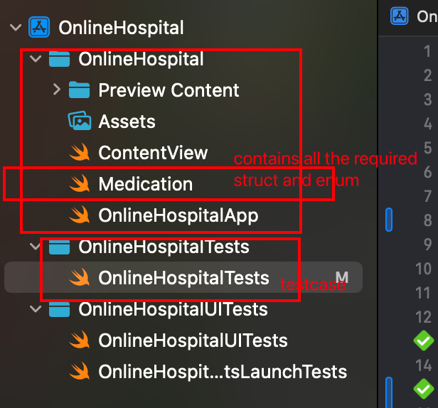
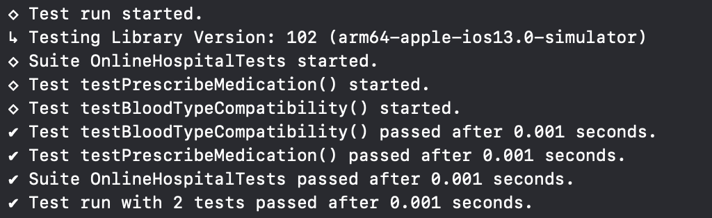

# cs342

# Assignment1
This figure illustrates the structure of the code files. The `onlinehospital` directory contains all the core logic of the code. In this project, views such as `ContentView` and `OnlineHospitalApp`, as well as various utility classes required for the development project (e.g., `Medication`), are not utilized.

## Core Components

### Medication
The `Medication` part includes the core components of this code: two `struct` classes and two `enum` classes.

- The `Medication` struct defines a `Medication` class with:
  - **6 properties**
  - **2 methods**:
    - A method for providing a description of the medication.
    - A method for determining whether the medication has been fully consumed.

### Patient
The `Patient` struct employs initializers and contains:

- **8 properties**
- **4 methods**:
  1. A method that returns the patient’s full name and age in years as a string, formatted as:  
     `"Last name, First name (Age in years)"`, as it might appear in a list.
  2. A method that returns a list of medications the patient is currently taking, ordered by the date they were prescribed, excluding any completed medications.
  3. A method for prescribing a new medication to a patient, ensuring no duplicate medications are prescribed. If a duplicate is prescribed, the method throws an appropriate error.
  4. An **extension** method to determine which blood types are compatible for the patient.

  ## Code Tests
  All test code is located in the `OnlineHospitalTests` module. It includes:

- Tests for different blood types.
- Functional tests for all implemented methods.
- Tests for the `Medication` class methods.
  All testcases have been passed as shown below.
  

# Assignment2

## Conclusion

In this assignment, I have implemented two SwiftUI views: `PatientDetailView` and `PrescribeMedicationView`, which are part of a larger `OnlineHospital` application. These views are designed to display patient details and allow the prescription of new medications, respectively. This report explains the thought process behind the design choices, the functionality of the code, and the SwiftUI concepts used.

---

## Design Overview

The goal was to create modular, maintainable, and testable views while ensuring a seamless user experience. Both views follow SwiftUI's declarative and reactive design principles, which simplify state management and UI updates.

### 1. Modular Design

Each view serves a specific purpose:

- **`PatientDetailView`**: Displays patient details (name, age, height, weight, blood type) and their current medications. It also provides an option to prescribe new medications.

- **`PrescribeMedicationView`**: A form where the user can input medication details (name, dose, route, frequency, and duration) and save the prescription.

This separation adheres to the **Single Responsibility Principle**, making the views easier to maintain and extend.

---

## SwiftUI Concepts Used

### 1. `@State`

`@State` is used for managing view-specific state variables. These states are local to the view and automatically trigger UI updates when modified. 
### 2. `@ObservedObject`
`@ObservedObject` is used to observe a shared data model (`PatientStore`) that provides data across multiple views. Changes in the `PatientStore` automatically update any observing views.

---

### NavigationStack and Toolbars
- **NavigationStack** is used for hierarchical navigation and provides a modern approach to managing navigation stacks in SwiftUI.
- **Toolbars** are added for action buttons such as "Cancel" and "Save."

---

### Form Validation
Form validation ensures data integrity by enabling the "Save" button only when all required fields are valid.

